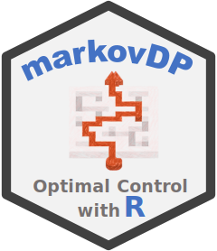

#  R package markovDP - Infrastructure for Discrete-Time Markov Decision Processes (MDP)

[](https://mhahsler.r-universe.dev/markovDP)
[](https://CRAN.R-project.org/package=markovDP)
[](https://CRAN.R-project.org/package=markovDP)

## Introduction

A Markov decision process (MDP) ([Bellman 1957](#ref-Bellman1957);
[Howard 1960](#ref-Howard1960)) is a discrete-time stochastic control
process. In each time step, an agent can perform actions which affect
the system (i.e., may cause the system state to change). The agent’s
goal is to maximize its expected future rewards that depend on the
sequence of system state and the agent’s actions in the future. Solving
the MDP means finding the optimal (or at least a good) policy that
guides the agent’s actions.

The `markovDP` package provides the infrastructure to work with MDPs in
R. The focus is on convenience in formulating MDPs with small to medium
sized state spaces in multiple ways, the support of sparse
representations (using sparse matrices, lists and data.frames) and
visualization of results. Some key components are implemented in C++ to
speed up computation. The package provides the following popular tabular
methods:

- **Dynamic Programming**
  - Value Iteration ([Bellman 1957](#ref-Bellman1957))
  - Modified Policy Iteration ([Howard 1960](#ref-Howard1960); [Puterman
    and Shin 1978](#ref-Puterman1978))
  - Prioritized Sweeping ([Moore and Atkeson 1993](#ref-Moore1993);
    [Andre, Friedman, and Parr 1997](#ref-Andre1997); [Li and Littman
    2008](#ref-Li2008))
- **Linear Programming**
  - Primal Formulation ([Manne 1960](#ref-Manne1960))
- **Monte Carlo Control**
  - Monte Carlo Control with Exploring Starts ([Sutton and Barto
    2018](#ref-Sutton1998))
  - On-policy Monte Carlo Control ([Sutton and Barto
    2018](#ref-Sutton1998))
  - Off-policy Monte Carlo Control ([Sutton and Barto
    2018](#ref-Sutton1998))
- **Sampling**
  - Random-sample one-step tabular Q-planning ([Sutton and Barto
    2018](#ref-Sutton1998))
- **Tabular Termporal Differencing**
  - Q-Learning ([Watkins and Dayan 1992](#ref-Watkins1992))
  - 1-step Sarsa ([Rummery and Niranjan 1994](#ref-Rummery1994))
  - Expected Sarsa ([Sutton and Barto 2018](#ref-Sutton1998))
  - n-step Sarsa ([Sutton and Barto 2018](#ref-Sutton1998))
  - Sarsa(lamba) ([Sutton and Barto 2018](#ref-Sutton1998))
  - Watkins’s Q(lamba) ([Sutton and Barto 2018](#ref-Sutton1998))
- **Temporal Differencing with Function Approximation**
  - 1-step Sarsa ([Sutton and Barto 2018](#ref-Sutton1998); [Geramifard
    et al. 2013](#ref-Geramifard2013))
  - Sarsa(lambda) ([Sutton and Barto 2018](#ref-Sutton1998))
  - GTD(lambda) ([Sutton and Barto 2018](#ref-Sutton1998))

These implementations follow the description is ([Russell and Norvig
2020](#ref-Russell2020)) and ([Sutton and Barto 2018](#ref-Sutton1998)).
The implementations represent the state space explicitly, so only
problems with small to medium state spaces can be used.

Partially observable Markov Decision Problems (POMDPs) can me modeled in
a similar fashion using package **pomdp** ([Hahsler
2024](#ref-CRAN_pomdp)).

To cite package ‘markovDP’ in publications use:

> Hahsler M (2024). *markovDP: Infrastructure for Discrete-Time Markov
> Decision Processes (MDP)*. R package version 0.99.0,
> <https://github.com/mhahsler/markovDP>.

    @Manual{,
      title = {markovDP: Infrastructure for Discrete-Time Markov Decision Processes (MDP)},
      author = {Michael Hahsler},
      year = {2024},
      note = {R package version 0.99.0},
      url = {https://github.com/mhahsler/markovDP},
    }

## Installation

**Current development version:** Install from
[r-universe.](https://mhahsler.r-universe.dev/markovDP)

``` r
install.packages("markovDP",
    repos = c("https://mhahsler.r-universe.dev",
              "https://cloud.r-project.org/"))
```

## Usage

Solving the simple maze from ([Russell and Norvig
2020](#ref-Russell2020)).

``` r
library("markovDP")
data("Maze")
Maze
```

    ## MDP, MDPE - Stuart Russell's 3x4 Maze
    ##   Discount factor: 1
    ##   Horizon: Inf epochs
    ##   Size: 11 states / 4 actions
    ##   Storage: transition prob as matrix / reward as matrix. Total size: 28.8 Kb
    ##   Start: s(3,1)
    ## 
    ##   List components: 'name', 'discount', 'horizon', 'states', 'actions',
    ##     'start', 'transition_prob', 'reward', 'info', 'absorbing_states'

The maze is a gridworld and can be displayed directly.

``` r
gw_plot(Maze, state = TRUE)
```

<!-- -->

``` r
sol <- solve_MDP(model = Maze)
sol
```

    ## MDP, MDPE - Stuart Russell's 3x4 Maze
    ##   Discount factor: 1
    ##   Horizon: Inf epochs
    ##   Size: 11 states / 4 actions
    ##   Storage: transition prob as matrix / reward as matrix. Total size: 32.3 Kb
    ##   Start: s(3,1)
    ##   Solved:
    ##     Method: 'VI'
    ##     Solution converged: TRUE
    ## 
    ##   List components: 'name', 'discount', 'horizon', 'states', 'actions',
    ##     'start', 'transition_prob', 'reward', 'info', 'absorbing_states',
    ##     'solution'

Display the value function.

``` r
plot_value_function(sol)
```

<!-- -->

The state values can be shown in the gridworld as colored map.

``` r
gw_plot(sol)
```

<!-- -->

## Acknowledgments

Development of this package was supported in part by National Institute
of Standards and Technology (NIST) under grant number
[60NANB17D180](https://www.nist.gov/ctl/pscr/safe-net-integrated-connected-vehicle-computing-platform).

## References

<div id="refs" class="references csl-bib-body hanging-indent"
entry-spacing="0">

<div id="ref-Andre1997" class="csl-entry">

Andre, David, Nir Friedman, and Ronald Parr. 1997. “Generalized
Prioritized Sweeping.” In *Advances in Neural Information Processing
Systems*, edited by M. Jordan, M. Kearns, and S. Solla. Vol. 10. MIT
Press.
<https://proceedings.neurips.cc/paper_files/paper/1997/file/7b5b23f4aadf9513306bcd59afb6e4c9-Paper.pdf>.

</div>

<div id="ref-Bellman1957" class="csl-entry">

Bellman, Richard. 1957. “A Markovian Decision Process.” *Indiana
University Mathematics Journal* 6: 679–84.
<https://www.jstor.org/stable/24900506>.

</div>

<div id="ref-Geramifard2013" class="csl-entry">

Geramifard, Alborz, Thomas J. Walsh, Tellex Stefanie, Girish Chowdhary,
Nicholas Roy, and Jonathan P. How. 2013.
<https://doi.org/10.1561/2200000042>.

</div>

<div id="ref-CRAN_pomdp" class="csl-entry">

Hahsler, Michael. 2024. *Pomdp: Infrastructure for Partially Observable
Markov Decision Processes (POMDP)*.
<https://doi.org/10.32614/CRAN.package.pomdp>.

</div>

<div id="ref-Howard1960" class="csl-entry">

Howard, R. A. 1960. *Dynamic Programming and Markov Processes*.
Cambridge, MA: MIT Press.

</div>

<div id="ref-Li2008" class="csl-entry">

Li, Lihong, and Michael Littman. 2008. “Prioritized Sweeping Converges
to the Optimal Value Function.” DCS-TR-631. Rutgers University.
<https://doi.org/10.7282/T3TX3JSX>.

</div>

<div id="ref-Manne1960" class="csl-entry">

Manne, Alan. 1960. “On the Job-Shop Scheduling Problem.” *Operations
Research* 8 (2): 219–23. <https://doi.org/10.1287/opre.8.2.219>.

</div>

<div id="ref-Moore1993" class="csl-entry">

Moore, Andrew, and C. G. Atkeson. 1993. “Prioritized Sweeping:
Reinforcement Learning with Less Data and Less Real Time.” *Machine
Learning* 13 (1): 103–30. <https://doi.org/10.1007/BF00993104>.

</div>

<div id="ref-Puterman1978" class="csl-entry">

Puterman, Martin L., and Moon Chirl Shin. 1978. “Modified Policy
Iteration Algorithms for Discounted Markov Decision Problems.”
*Management Science* 24: 1127–37.
<https://doi.org/10.1287/mnsc.24.11.1127>.

</div>

<div id="ref-Rummery1994" class="csl-entry">

Rummery, G., and Mahesan Niranjan. 1994. “On-Line Q-Learning Using
Connectionist Systems.” Techreport CUED/F-INFENG/TR 166. Cambridge
University Engineering Department.

</div>

<div id="ref-Russell2020" class="csl-entry">

Russell, Stuart J., and Peter Norvig. 2020. *Artificial Intelligence: A
Modern Approach (4th Edition)*. Pearson. <http://aima.cs.berkeley.edu/>.

</div>

<div id="ref-Sutton1998" class="csl-entry">

Sutton, Richard S., and Andrew G. Barto. 2018. *Reinforcement Learning:
An Introduction*. Second. The MIT Press.
<http://incompleteideas.net/book/the-book-2nd.html>.

</div>

<div id="ref-Watkins1992" class="csl-entry">

Watkins, Christopher J. C. H., and Peter Dayan. 1992. “Q-Learning.”
*Machine Learning* 8 (3): 279–92. <https://doi.org/10.1007/BF00992698>.

</div>

</div>
