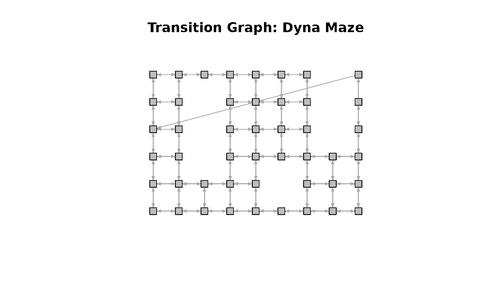
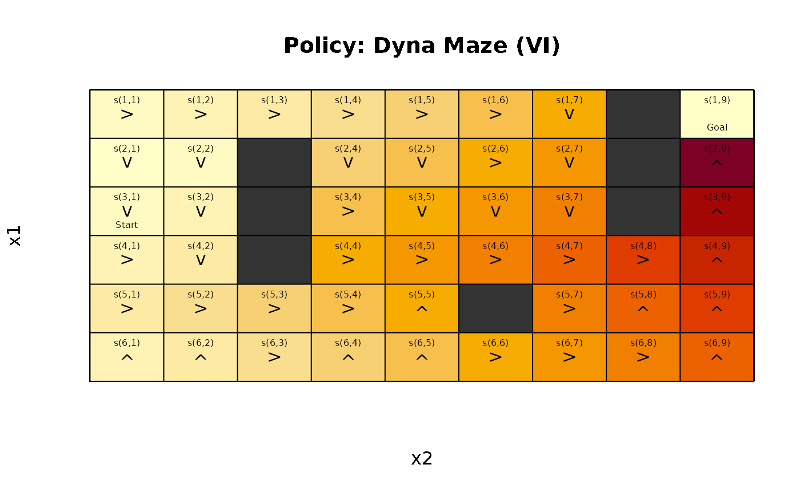
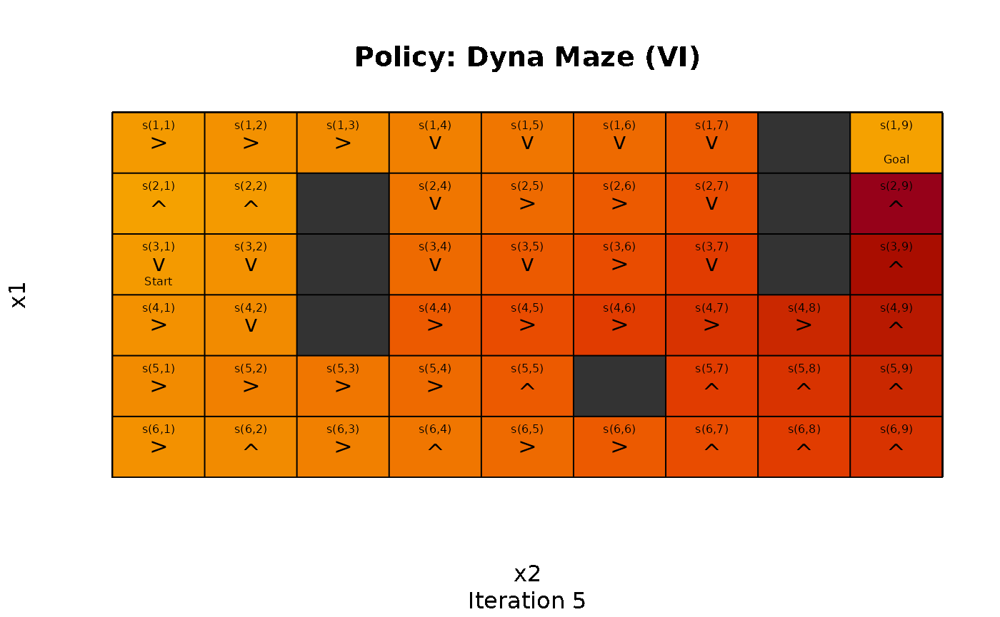
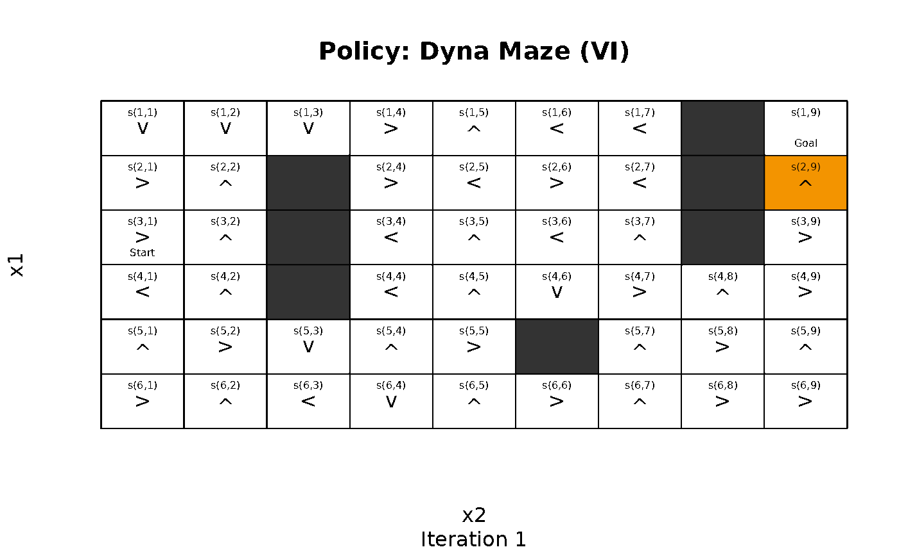
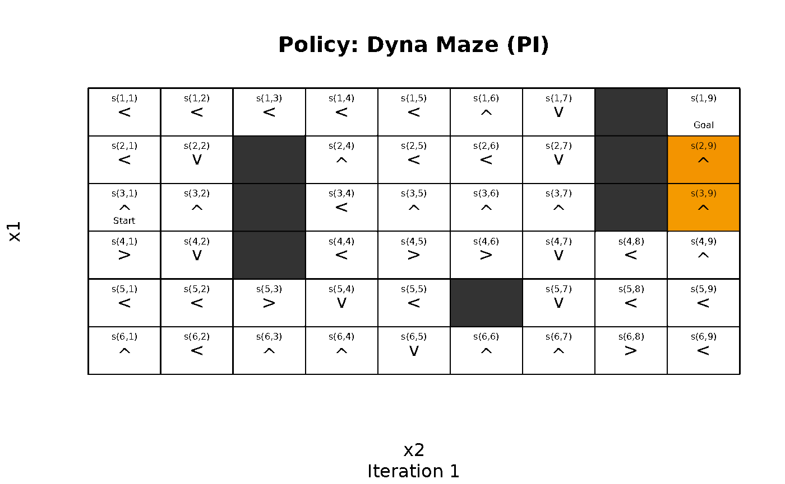
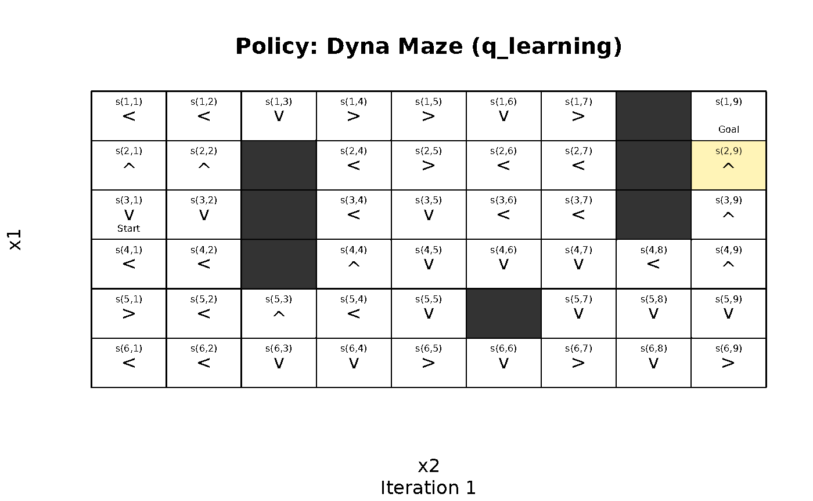

# Gridworlds as MDPs

``` r

library(markovDP)
```

### Introduction

Gridworlds represent an easy to explore how Markov Decision Problems
(MDPs) and various approaches to solve these problems work. The R
package **markovDP** ([Hahsler 2024](#ref-CRAN_markovDP)) provides a set
of helper functions starting with the prefix `gw_` to make defining and
experimenting with gridworlds easy.

### Defining a Gridworld

Many gridworlds represent mazes with start and goal states that the
agent needs to solve. Mazes can be easily defined. Here we create the
Dyna Maze from Chapter 8 in ([Sutton and Barto 2018](#ref-Sutton1998)).

``` r

x <- gw_maze_MDP(
  dim = c(6, 9),
  start = "s(3,1)",
  goal = "s(1,9)",
  walls = c(
    "s(2,3)", "s(3,3)", "s(4,3)",
    "s(5,6)",
    "s(1,8)", "s(2,8)", "s(3,8)"
  ),
  goal_reward = 1,
  step_cost = 0,
  restart = TRUE,
  discount = 0.95,
  name = "Dyna Maze",
)
x
#> MDPModel, MDP - Dyna Maze
#>   Discount factor: 0.95
#>   Horizon: Inf epochs
#>   Size: 4 actions / 47 states
#>   Storage: transition prob as function / reward as data.frame. Total size: 44.7 Kb
#>   Start: s(3,1)
#>   Model list components: 'name', 'discount', 'horizon', 'states',
#>     'actions', 'start', 'transition_model', 'reward', 'info',
#>     'absorbing_states'
```

Normalize the model for faster access.

``` r

x <- normalize_MDP(x)
```

Gridworlds are implemented with state names `"s(<row>,<col>)"`, where
`row` and `col` are locations in the matrix representing the gridworld.
The actions are `"up"`, `"right"`, `"down"`, and `"left"`. Conversion
between state labels and the position in the matrix (row and column
index) can be done with
[`gw_s2rc()`](http://michael.hahsler.net/markovDP/reference/gridworld.md)
and
[`gw_rc2s()`](http://michael.hahsler.net/markovDP/reference/gridworld.md),
respectively.

The transition graph can be visualized. Note, the transition from the
state below the goal state back to the start state shows that the maze
restarts the agent once it reaches the goal and collects the goal
reward.

``` r

gw_plot_transition_graph(x)
```



A more general way to create gridworlds is implemented in the function
[`gw_init()`](http://michael.hahsler.net/markovDP/reference/gridworld.md)
which initializes a new gridworld creating a matrix of states with given
dimensions. Blocked states and absorbing state can be defined. The
returned information can be used to build a custom gridworld MDP.

### Working with Gridworld MDPs

The gridworld can be accessed as a matrix.

``` r

gw_matrix(x)
#>      [,1]     [,2]     [,3]     [,4]     [,5]     [,6]     [,7]     [,8]    
#> [1,] "s(1,1)" "s(1,2)" "s(1,3)" "s(1,4)" "s(1,5)" "s(1,6)" "s(1,7)" NA      
#> [2,] "s(2,1)" "s(2,2)" NA       "s(2,4)" "s(2,5)" "s(2,6)" "s(2,7)" NA      
#> [3,] "s(3,1)" "s(3,2)" NA       "s(3,4)" "s(3,5)" "s(3,6)" "s(3,7)" NA      
#> [4,] "s(4,1)" "s(4,2)" NA       "s(4,4)" "s(4,5)" "s(4,6)" "s(4,7)" "s(4,8)"
#> [5,] "s(5,1)" "s(5,2)" "s(5,3)" "s(5,4)" "s(5,5)" NA       "s(5,7)" "s(5,8)"
#> [6,] "s(6,1)" "s(6,2)" "s(6,3)" "s(6,4)" "s(6,5)" "s(6,6)" "s(6,7)" "s(6,8)"
#>      [,9]    
#> [1,] "s(1,9)"
#> [2,] "s(2,9)"
#> [3,] "s(3,9)"
#> [4,] "s(4,9)"
#> [5,] "s(5,9)"
#> [6,] "s(6,9)"
gw_matrix(x, what = "labels")
#>      [,1]    [,2] [,3] [,4] [,5] [,6] [,7] [,8] [,9]  
#> [1,] ""      ""   ""   ""   ""   ""   ""   "X"  "Goal"
#> [2,] ""      ""   "X"  ""   ""   ""   ""   "X"  ""    
#> [3,] "Start" ""   "X"  ""   ""   ""   ""   "X"  ""    
#> [4,] ""      ""   "X"  ""   ""   ""   ""   ""   ""    
#> [5,] ""      ""   ""   ""   ""   "X"  ""   ""   ""    
#> [6,] ""      ""   ""   ""   ""   ""   ""   ""   ""
gw_matrix(x, what = "unreachable")
#>       [,1]  [,2]  [,3]  [,4]  [,5]  [,6]  [,7]  [,8]  [,9]
#> [1,] FALSE FALSE FALSE FALSE FALSE FALSE FALSE  TRUE FALSE
#> [2,] FALSE FALSE  TRUE FALSE FALSE FALSE FALSE  TRUE FALSE
#> [3,] FALSE FALSE  TRUE FALSE FALSE FALSE FALSE  TRUE FALSE
#> [4,] FALSE FALSE  TRUE FALSE FALSE FALSE FALSE FALSE FALSE
#> [5,] FALSE FALSE FALSE FALSE FALSE  TRUE FALSE FALSE FALSE
#> [6,] FALSE FALSE FALSE FALSE FALSE FALSE FALSE FALSE FALSE
```

`NA` represents states that were excluded from the state space since
they are not reachable (e.g., walls). Other options for `what` are
`"values"` (for state values) and `"action"`, but these are only
available for solved problems that contain a policy.

### Solving a Gridworld

Gridworld MDPs are solved like any other MDP.

``` r

sol <- solve_MDP(x)
sol
#> MDPModel, MDP - Dyna Maze
#>   Discount factor: 0.95
#>   Horizon: Inf epochs
#>   Size: 4 actions / 47 states
#>   Storage: transition prob as matrix / reward as matrix. Total size: 202.6 Kb
#>   Start: s(3,1)
#>   Model list components: 'name', 'discount', 'horizon', 'states',
#>     'actions', 'start', 'transition_model', 'reward', 'info',
#>     'absorbing_states', 'solution'
#> 
#>   Solved:
#>     Method: 'VI'
#>     Solution converged: TRUE
#>   Solution list components: 'method', 'policy', 'converged', 'delta',
#>     'iterations'
```

Detailed information about the solution can be accessed.

``` r

sol$solution
#> $method
#> [1] "VI"
#> 
#> $policy
#> $policy[[1]]
#>     state         V action
#> 1  s(1,1) 0.9564197  right
#> 2  s(2,1) 0.9085510   down
#> 3  s(3,1) 0.9564197   down
#> 4  s(4,1) 1.0067576  right
#> 5  s(5,1) 1.0597448  right
#> 6  s(6,1) 1.0067576     up
#> 7  s(1,2) 1.0067576  right
#> 8  s(2,2) 0.9564197   down
#> 9  s(3,2) 1.0067576   down
#> 10 s(4,2) 1.0597448   down
#> 11 s(5,2) 1.1155208  right
#> 12 s(6,2) 1.0597448     up
#> 13 s(1,3) 1.0597448  right
#> 14 s(5,3) 1.1742325  right
#> 15 s(6,3) 1.1155208  right
#> 16 s(1,4) 1.1155208  right
#> 17 s(2,4) 1.1742325   down
#> 18 s(3,4) 1.2360342  right
#> 19 s(4,4) 1.3010886  right
#> 20 s(5,4) 1.2360342  right
#> 21 s(6,4) 1.1742325     up
#> 22 s(1,5) 1.1742325  right
#> 23 s(2,5) 1.2360342   down
#> 24 s(3,5) 1.3010886   down
#> 25 s(4,5) 1.3695669  right
#> 26 s(5,5) 1.3010886     up
#> 27 s(6,5) 1.2360342     up
#> 28 s(1,6) 1.2360342  right
#> 29 s(2,6) 1.3010886  right
#> 30 s(3,6) 1.3695669   down
#> 31 s(4,6) 1.4416494  right
#> 32 s(6,6) 1.3010886  right
#> 33 s(1,7) 1.3010886   down
#> 34 s(2,7) 1.3695669   down
#> 35 s(3,7) 1.4416494   down
#> 36 s(4,7) 1.5175257  right
#> 37 s(5,7) 1.4416494  right
#> 38 s(6,7) 1.3695669  right
#> 39 s(4,8) 1.5973955  right
#> 40 s(5,8) 1.5175257     up
#> 41 s(6,8) 1.4416494  right
#> 42 s(1,9) 0.9085510     up
#> 43 s(2,9) 1.8631235     up
#> 44 s(3,9) 1.7699673     up
#> 45 s(4,9) 1.6814689     up
#> 46 s(5,9) 1.5973955     up
#> 47 s(6,9) 1.5175257     up
#> 
#> 
#> $converged
#> [1] TRUE
#> 
#> $delta
#> [1] 5.019446e-05
#> 
#> $iterations
#> [1] 194
```

Now the policy and the state values are available as a matrix.

``` r

gw_matrix(sol, what = "values")
#>           [,1]      [,2]     [,3]     [,4]     [,5]     [,6]     [,7]     [,8]
#> [1,] 0.9564197 1.0067576 1.059745 1.115521 1.174232 1.236034 1.301089       NA
#> [2,] 0.9085510 0.9564197       NA 1.174232 1.236034 1.301089 1.369567       NA
#> [3,] 0.9564197 1.0067576       NA 1.236034 1.301089 1.369567 1.441649       NA
#> [4,] 1.0067576 1.0597448       NA 1.301089 1.369567 1.441649 1.517526 1.597395
#> [5,] 1.0597448 1.1155208 1.174232 1.236034 1.301089       NA 1.441649 1.517526
#> [6,] 1.0067576 1.0597448 1.115521 1.174232 1.236034 1.301089 1.369567 1.441649
#>          [,9]
#> [1,] 0.908551
#> [2,] 1.863123
#> [3,] 1.769967
#> [4,] 1.681469
#> [5,] 1.597395
#> [6,] 1.517526
gw_matrix(sol, what = "actions")
#>      [,1]    [,2]    [,3]    [,4]    [,5]    [,6]    [,7]    [,8]    [,9]
#> [1,] "right" "right" "right" "right" "right" "right" "down"  NA      "up"
#> [2,] "down"  "down"  NA      "down"  "down"  "right" "down"  NA      "up"
#> [3,] "down"  "down"  NA      "right" "down"  "down"  "down"  NA      "up"
#> [4,] "right" "down"  NA      "right" "right" "right" "right" "right" "up"
#> [5,] "right" "right" "right" "right" "up"    NA      "right" "up"    "up"
#> [6,] "up"    "up"    "right" "up"    "up"    "right" "right" "right" "up"
```

A visual presentation with the state value represented by color (darker
is larger), the policy represented by action arrows, and the labels
added is also available.

``` r

gw_plot(sol)
```



We see that value iteration found a clear path from the start state
towards the goal state following increasing state values.

### Experimenting with Solvers

It is interesting to look how different solvers find a solution. We can
visualize how the policy and state values change after each iteration.
For example, we can stop the algorithm after a given number of
iterations and visualize the progress.

``` r

sol <- solve_MDP(x, method = "DP:VI", iter_max = 5)
#> Warning: In func(model, method, horizon, discount, ..., continue = continue,     verbose = verbose, progress = progress):
#>   Unknown arguments: iter_max = 5
#> Warning: In solve_MDP_DP_VI(model, error, n, V = V, progress = progress,     verbose = verbose, ...):
#>   Unknown arguments: iter_max = 5
gw_plot(sol, zlim = c(0, 2), sub = "Iteration 5")
```

 The solver
creates a warning indicating that the solution has not converged after
only 5 iterations. In the visualization, we see that value iteration has
expanded values from the goal state up to 5 squares away.

To see how the updates in the solver work, we can use
[`gw_animate()`](http://michael.hahsler.net/markovDP/reference/gridworld.md)
to draw a visualization after each iteration. R markdown documents can
use `{r, fig.show='animate'}` so create an animation using the
individual frames.

``` r

gw_animate(x, "DP:VI", n = 20, zlim = c(0, 2))
```



It is easy to see how value iteration propagates value from the goal to
the start. In the following, we create animations for more solving
methods.

``` r

gw_animate(x, "DP:PI", n = 15, zlim = c(0, 2))
```



``` r

gw_animate(x, "TD:q_learning", n = 15, zlim = c(0, 2), horizon = 1000)
```



## References

Hahsler, Michael. 2024. *markovDP: Infrastructure for Discrete-Time
Markov Decision Processes (MDP)*.
<https://github.com/mhahsler/markovDP>.

Sutton, Richard S., and Andrew G. Barto. 2018. *Reinforcement Learning:
An Introduction*. Second. The MIT Press.
[http://incompleteideas.net/book/the-book-2nd.html](http://incompleteideas.net/book/the-book-2nd.md).
