# Solving MDPs with Linear Approximation

## Introduction

The package **markovDP** ([Hahsler 2024](#ref-CRAN_markovDP)) implements
episodic semi-gradient Sarsa with linear state-value function
approximation following Sutton and Barto ([2018](#ref-Sutton1998)). The
state-action value construction uses the approach described in
Geramifard et al. ([2013](#ref-Geramifard2013)). First, we will use the
state features directly and then we will use a Fourier basis (see *Value
Function Approximation in Reinforcement Learning Using the Fourier
Basis* ([2011](#ref-Konidaris2011))).

### Linear Approximation

The state-action value function is approximated by

where is a weight vector and is a feature function that maps each
state-action pair to a feature vector. The gradient of the state-action
function is

### State-action Feature Vector Construction

For a small number of actions, we can follow the construction described
by Geramifard et al. ([2013](#ref-Geramifard2013)) which uses a state
feature function to construct the complete state-action feature vector.
Here, we also add an intercept term. The state-action feature vector has
length . It has the intercept and then one component for each action.
All these components are set to zero and only the active action
component is set to , where is the current state. For example, for the
state feature vector and action out of three possible actions , the
complete state-action feature vector is . The leading 1 is for the
intercept and the zeros represent the two not chosen actions.

This construction is implemented in `add_linear_approx_Q_function()`.

### Helper Functions

The following helper functions for using approximation are available:

- [`approx_Q_value()`](http://michael.hahsler.net/markovDP/reference/solve_MDP_APPROX.md)
  calculates approximate Q values given the weights in the model or
  specified weights.
- [`approx_greedy_action()`](http://michael.hahsler.net/markovDP/reference/solve_MDP_APPROX.md)
  uses approximate Q values given the weights in the model or specified
  weights to find the greedy action for a state.
- [`approx_greedy_policy()`](http://michael.hahsler.net/markovDP/reference/solve_MDP_APPROX.md)
  calculates the greedy-policy for the approximate Q values given the
  weights in the model or specified weights.

### Episodic Semi-gradient Sarsa

The implementation follows the algorithm given in Sutton and Barto
([2018](#ref-Sutton1998)).

### Example 1: A maze without walls

The step cost is 1. The start is top-left and the goal (+100 reward) is
bottom-right. This is the ideal problem for a linear approximation of
the Q-function using the x/y location as state features.

We start with defining an MDP for a small maze without walls.

``` r

library(markovDP)
m <- gw_maze_MDP(c(5, 5), start = "s(1,1)", goal = "s(5,5)")
```

State features for linear approximation are constructed automatically as
the x/y coordinates for the gridworld.

``` r

get_state_features(m)
#>        x1 x2
#> s(1,1)  1  1
#> s(2,1)  2  1
#> s(3,1)  3  1
#> s(4,1)  4  1
#> s(5,1)  5  1
#> s(1,2)  1  2
#> s(2,2)  2  2
#> s(3,2)  3  2
#> s(4,2)  4  2
#> s(5,2)  5  2
#> s(1,3)  1  3
#> s(2,3)  2  3
#> s(3,3)  3  3
#> s(4,3)  4  3
#> s(5,3)  5  3
#> s(1,4)  1  4
#> s(2,4)  2  4
#> s(3,4)  3  4
#> s(4,4)  4  4
#> s(5,4)  5  4
#> s(1,5)  1  5
#> s(2,5)  2  5
#> s(3,5)  3  5
#> s(4,5)  4  5
#> s(5,5)  5  5
```

[`solve_MDP_APPROX()`](http://michael.hahsler.net/markovDP/reference/solve_MDP_APPROX.md)
automatically constructs state-action features and adds them with an
approximate Q function to the model. The state-action features are
constructed as a vector with weights for an intercept and the state
features for each action.

``` r

set.seed(1000)
sol <- solve_MDP_APPROX(m, horizon = 1000, n = 100)
sol
#> MDPModel, MDP - A Maze
#>   Discount factor: 1
#>   Horizon: 1000 epochs
#>   Size: 4 actions / 25 states
#>   Storage: transition prob as matrix / reward as matrix. Total size: 134.2 Kb
#>   Start: s(1,1)
#>   Model list components: 'name', 'discount', 'horizon', 'states',
#>     'actions', 'start', 'transition_model', 'reward', 'info',
#>     'absorbing_states', 'solution'
#> 
#>   Solved:
#>     Method: 'sarsa'
#>     Solution converged: NA
#>   Solution list components: 'method', 'alpha', 'epsilon', 'n',
#>     'converged', 'q_approx_linear', 'policy'
```

The approximation contains the approximation function, the gradient
function, the transformation function, and the current weights.

``` r

sol$solution$q_approx_linear
#> q_approx_linear, approx_linear
#> 
#> transformation:
#> function (x) 
#> {
#>     x <- (x - min)/(max - min)
#>     if (intercept) 
#>         x <- c(x0 = 1, x)
#>     x
#> }
#> <bytecode: 0x561e10c70098>
#> <environment: 0x561e10c6f848>
#> 
#> weights:
#>    up.x0    up.x1    up.x2 right.x0 right.x1 right.x2  down.x0  down.x1 
#> 14.65528 12.30324 11.06122 28.63005 54.18888 17.00129 35.55476 23.71475 
#>  down.x2  left.x0  left.x1  left.x2 
#> 41.28264 13.77898 12.14905  9.10107
```

``` r

gw_plot(sol)
```

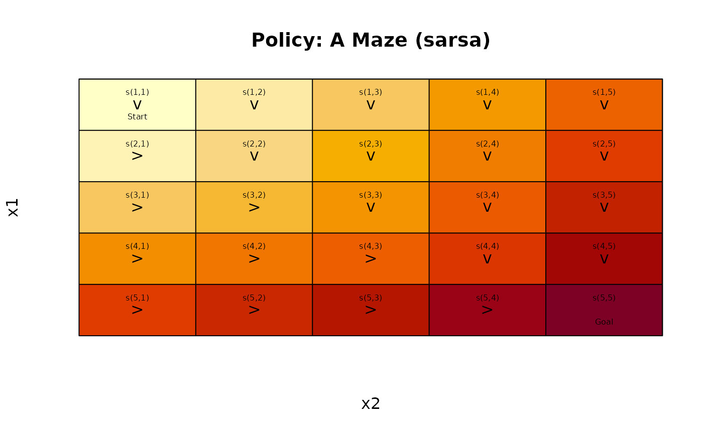

``` r

gw_matrix(sol, what = "value")
#>          [,1]     [,2]     [,3]     [,4]      [,5]
#> [1,] 35.55476 45.87542 56.19608 66.51674  76.83740
#> [2,] 42.17727 51.80411 62.12477 72.44543  82.76609
#> [3,] 55.72449 59.97481 68.05346 78.37411  88.69477
#> [4,] 69.27171 73.52203 77.77235 84.30280  94.62346
#> [5,] 82.81893 87.06925 91.31957 95.56989 100.55215
```

The approximate value function is continuous and can also be displayed
using matrix shading and contours

``` r

approx_V_plot(sol)
```

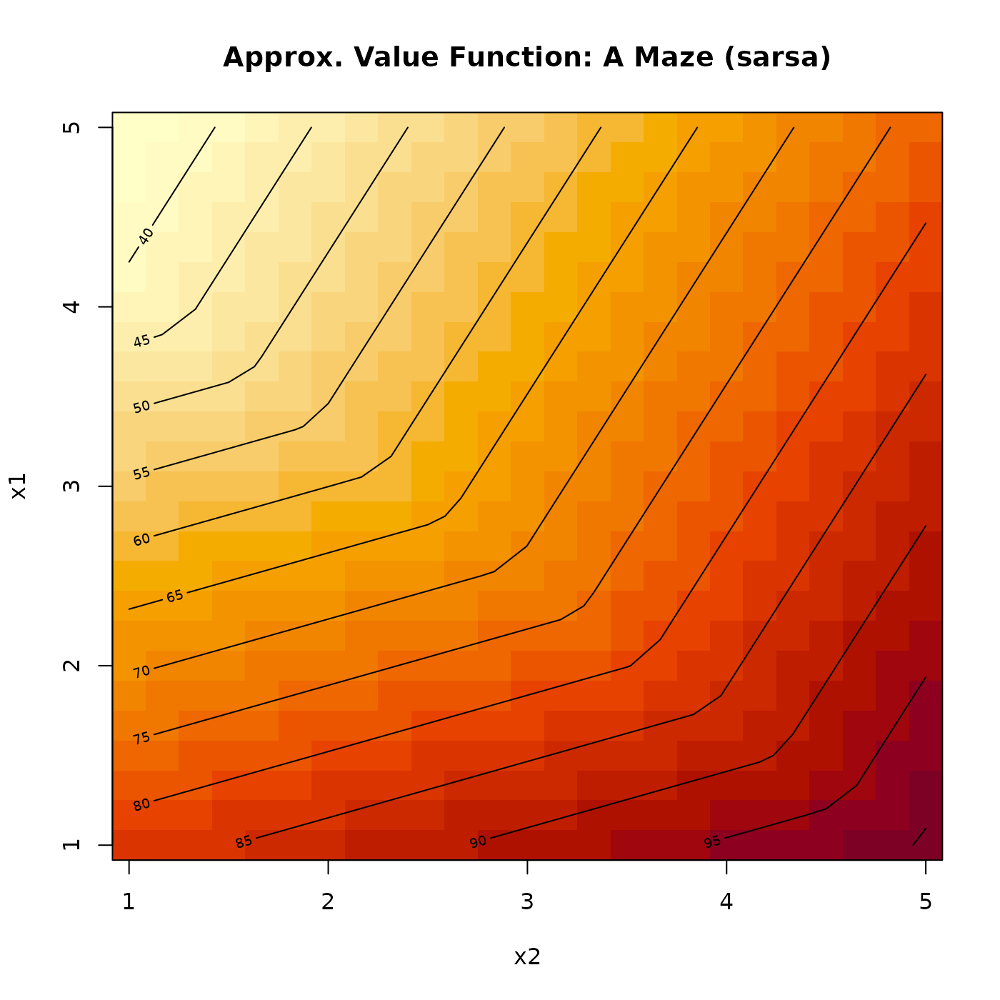

### Example 2: Stuart Russell’s 3x4 Maze using Linear Approximation

``` r

data(Maze)
gw_plot(Maze)
```


#### Linear Basis

The wall and the -1 absorbing state make linear approximation using just
the position more difficult.

Adding the linear approximation translates state names of the format
`s(feature list)` automatically.

``` r

sol <- solve_MDP_APPROX(Maze, horizon = 100, n = 100)
gw_plot(sol)
```

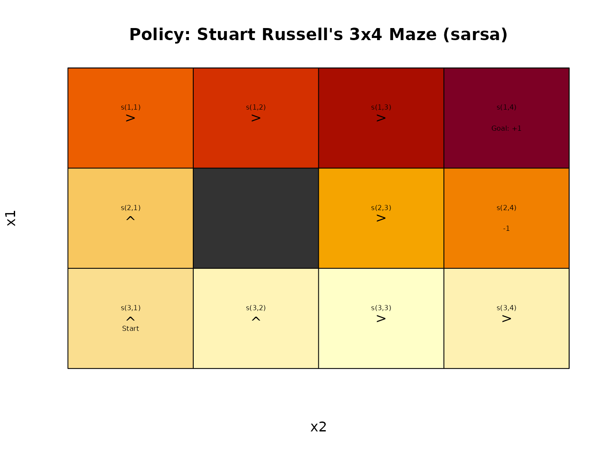

``` r

gw_matrix(sol, what = "value")
#>             [,1]       [,2]        [,3]        [,4]
#> [1,]  0.08549895  0.1668449  0.24819083  0.32953677
#> [2,] -0.14760272         NA -0.05836299  0.02298295
#> [3,] -0.21225927 -0.3014555 -0.36491681 -0.28357087
```

The linear approximation cannot deal with the center wall and the -1
absorbing state.

#### Order-1 Polynomial Basis

``` r

set.seed(2000)
sol <- solve_MDP_APPROX(Maze, horizon = 100, n = 100, 
                    transformation = transformation_polynomial_basis, order = 1)
gw_matrix(sol, what = "value")
#>             [,1]       [,2]       [,3]        [,4]
#> [1,]  0.06302514  0.1468219  0.2306187  0.31441548
#> [2,] -0.17499698         NA -0.1021554 -0.05995423
#> [3,] -0.23813195 -0.3590735 -0.4349296 -0.43432394
```

``` r

gw_plot(sol)
```

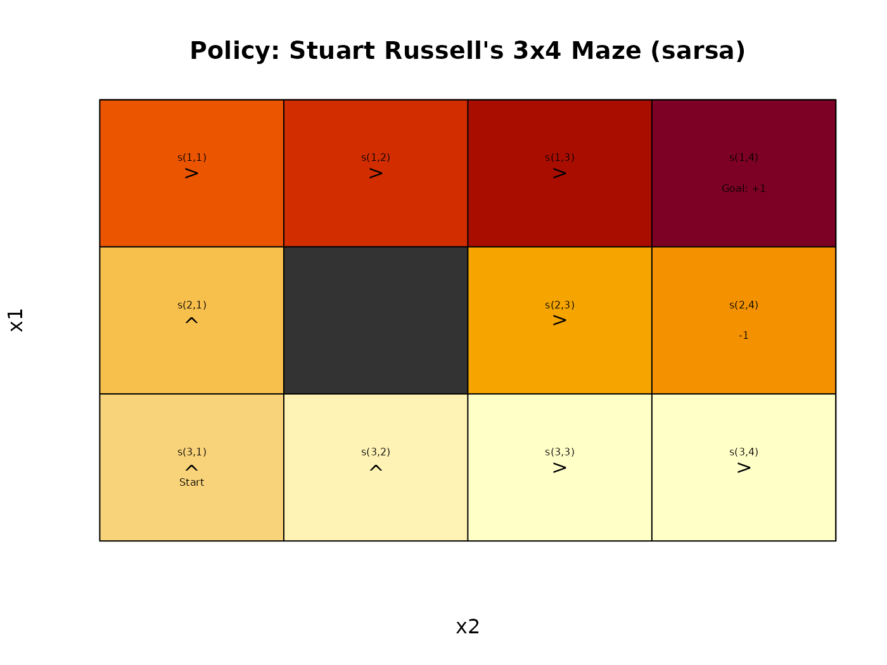

``` r

approx_V_plot(sol)
```

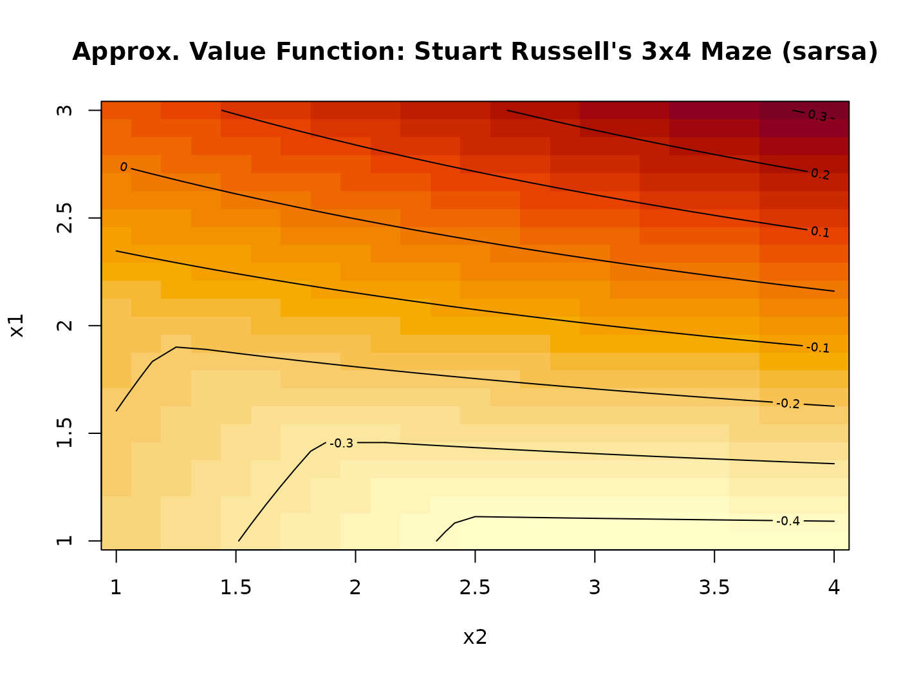

#### Radial Basis Function

``` r

set.seed(2000)
sol <- solve_MDP_APPROX(Maze, horizon = 100, n = 100, 
                         transformation = transformation_RBF_basis, centers = 4)
gw_matrix(sol, what = "value")
#>            [,1]       [,2]       [,3]       [,4]
#> [1,] -0.3146291 -0.3479713 -0.3310448 -0.2711929
#> [2,] -0.4932884         NA -0.5356629 -0.4464933
#> [3,] -0.5197404 -0.5890358 -0.5751003 -0.4840980
```

``` r

gw_plot(sol)
```

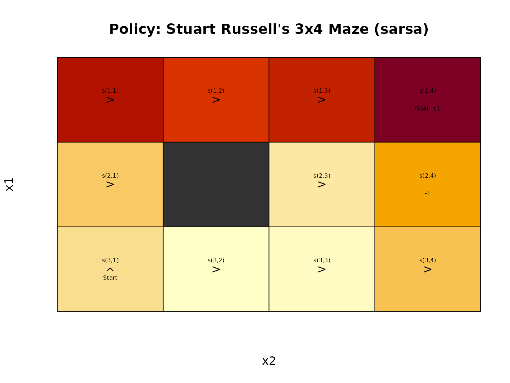

``` r

approx_V_plot(sol)
```

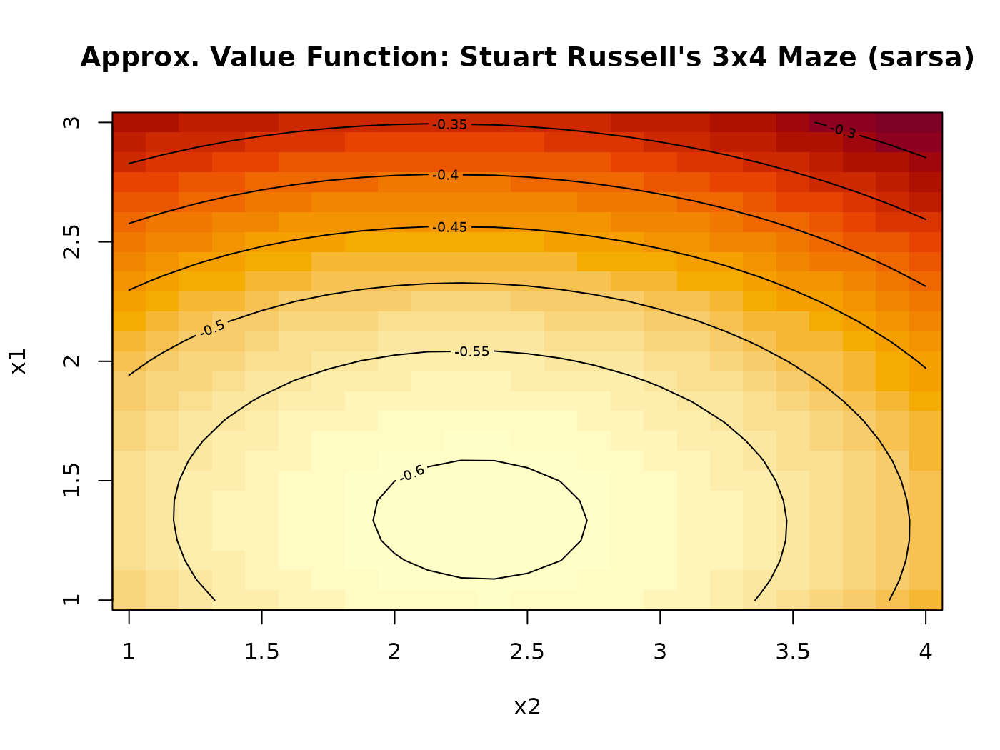

#### Order-1 Fourier Basis

``` r

set.seed(2000)
sol <- solve_MDP_APPROX(Maze, horizon = 100, n = 500, 
                        transformation = transformation_fourier_basis, order = 1)
gw_matrix(sol, what = "value")
#>           [,1]        [,2]       [,3]       [,4]
#> [1,] 0.5855731  0.69108058  0.9020955  1.0076030
#> [2,] 0.2697708          NA  0.3403607  0.3252111
#> [3,] 0.1598483 -0.08908583 -0.2140090 -0.2163907
```

``` r

gw_plot(sol)
```

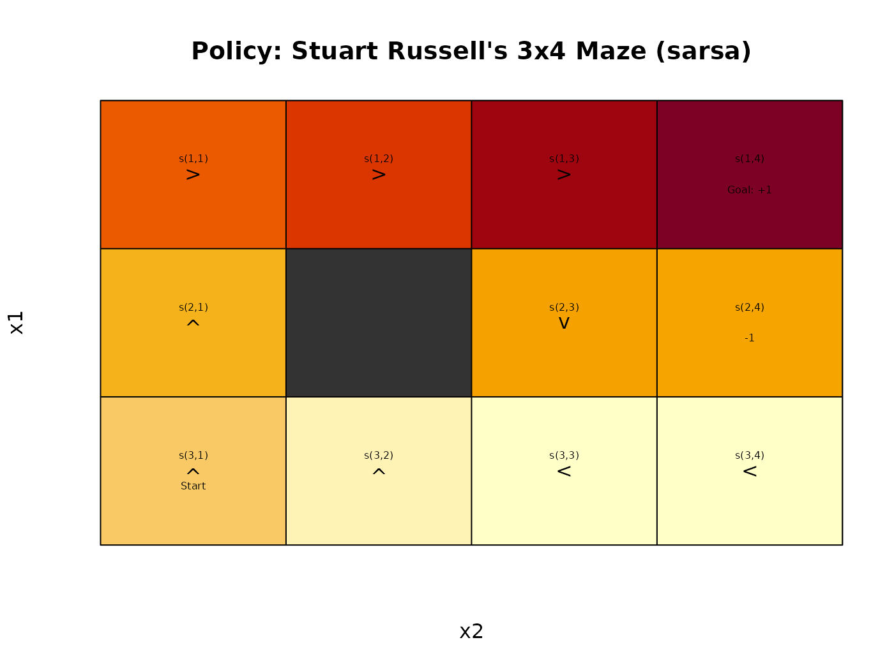

``` r

approx_V_plot(sol)
```

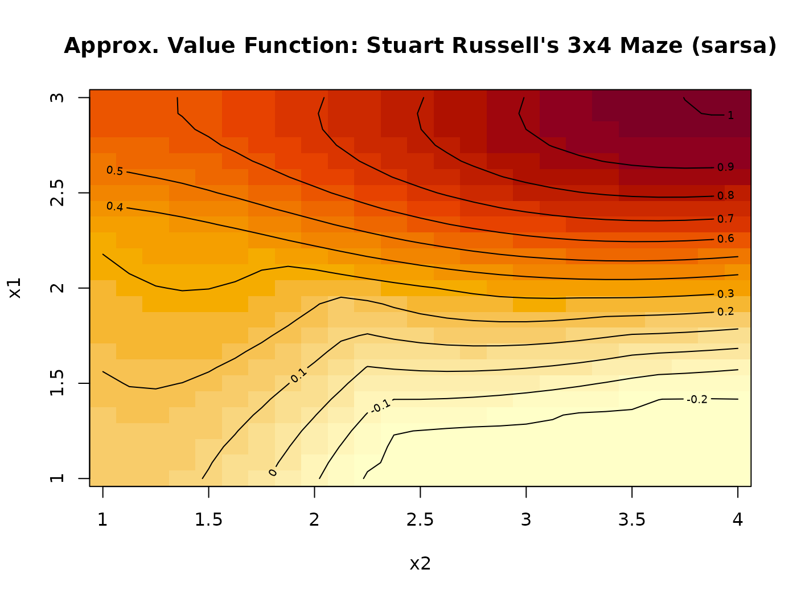

## Example 3: Wall Maze

``` r

Maze <- gw_read_maze(
  textConnection(c("XXXXXXXXXXXX",
                   "X          X",
                   "X S        X",
                   "X          X",
                   "XXXXXXXXX  X",
                   "X          X",
                   "X G        X",
                   "X          X",
                   "XXXXXXXXXXXX"
                   )))
```

We use a Fourier basis.

``` r

set.seed(2000)
sol <- solve_MDP_APPROX(Maze, horizon = 100, n = 100, 
                        transformation = transformation_fourier_basis, order = 2)
gw_matrix(sol, what = "value")
#>       [,1]       [,2]        [,3]         [,4]        [,5]       [,6]      [,7]
#>  [1,]   NA         NA          NA           NA          NA         NA        NA
#>  [2,]   NA -46.502016 -46.6903325 -46.71394582 -46.2849930 -46.665292 -47.12910
#>  [3,]   NA -46.666536 -47.0613781 -47.02980311 -46.7562387 -46.542679 -46.54348
#>  [4,]   NA -44.270445 -43.7844902 -42.36769437 -41.4314036 -40.585566 -40.10950
#>  [5,]   NA         NA          NA           NA          NA         NA        NA
#>  [6,]   NA -24.138325 -18.2328292 -16.35658238 -10.1888835  -8.506035 -11.11675
#>  [7,]   NA  -9.133891  -3.2647336  -0.06000604  -0.8634507  -5.222390 -11.66333
#>  [8,]   NA   1.867472   0.2316553  -4.23914364 -10.3996297 -16.817582 -22.26907
#>  [9,]   NA         NA          NA           NA          NA         NA        NA
#>            [,8]      [,9]     [,10]     [,11] [,12]
#>  [1,]        NA        NA        NA        NA    NA
#>  [2,] -47.95976 -48.15972 -47.89146 -47.78023    NA
#>  [3,] -46.65089 -46.77235 -45.60198 -44.36449    NA
#>  [4,] -39.82375 -39.89376 -38.33277 -36.62271    NA
#>  [5,]        NA        NA -31.21900 -29.80965    NA
#>  [6,] -16.37073 -21.99432 -26.13210 -27.34102    NA
#>  [7,] -18.31313 -23.63792 -26.97048 -28.28813    NA
#>  [8,] -26.09657 -28.28826 -29.26895 -29.21684    NA
#>  [9,]        NA        NA        NA        NA    NA
```

``` r

gw_plot(sol)
```

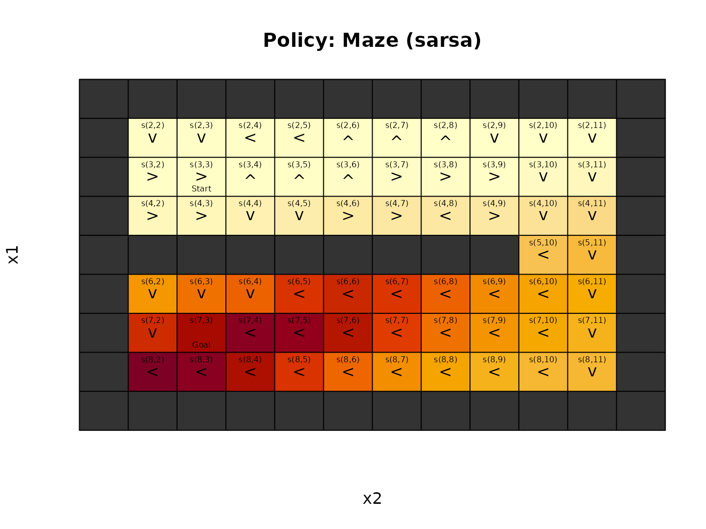

``` r

approx_V_plot(sol)
```

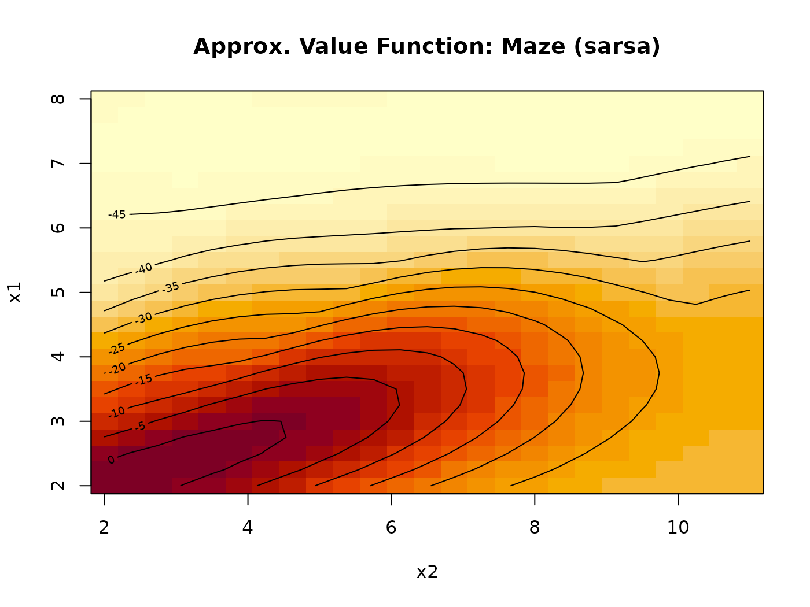

## References

Geramifard, Alborz, Thomas J. Walsh, Tellex Stefanie, Girish Chowdhary,
Nicholas Roy, and Jonathan P. How. 2013.
<https://doi.org/10.1561/2200000042>.

Hahsler, Michael. 2024. *markovDP: Infrastructure for Discrete-Time
Markov Decision Processes (MDP)*.
<https://github.com/mhahsler/markovDP>.

Sutton, Richard S., and Andrew G. Barto. 2018. *Reinforcement Learning:
An Introduction*. Second. The MIT Press.
[http://incompleteideas.net/book/the-book-2nd.html](http://incompleteideas.net/book/the-book-2nd.md).

*Value Function Approximation in Reinforcement Learning Using the
Fourier Basis*. 2011. 25: 380–85.
<https://doi.org/10.1609/aaai.v25i1.7903>.
