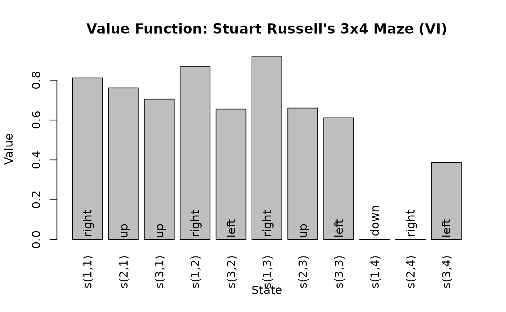

# Introduction to Discrete-Time Markov Decision Processes

## Introduction

The package **markovDP** ([Hahsler 2024a](#ref-CRAN_markovDP)) provides
the infrastructure to work with discrete-time Markov Decision Processes
(MDPs) ([Bellman 1957](#ref-Bellman1957); [Howard
1960](#ref-Howard1960)) in R. The focus is on convenience in formulating
MDPs, the support of sparse representations (using sparse matrices,
lists and data.frames) and visualization of results. Some key components
are implemented in C++ to speed up computation. It also provides to the
following popular solving procedures:

- **Dynamic Programming**
  - Value Iteration ([Bellman 1957](#ref-Bellman1957))
  - Modified Policy Iteration ([Howard 1960](#ref-Howard1960); [Puterman
    and Shin 1978](#ref-Puterman1978))
  - Prioritized Sweeping ([Moore and Atkeson 1993](#ref-Moore1993); [Li
    and Littman 2008](#ref-Li2008))
- **Linear Programming**
  - Primal Formulation ([Manne 1960](#ref-Manne1960))
- **Monte Carlo Control**
  - Monte Carlo Control with Exploring Starts ([Sutton and Barto
    2018](#ref-Sutton1998))
  - On-policy Monte Carlo Control ([Sutton and Barto
    2018](#ref-Sutton1998))
  - Off-policy Monte Carlo Control ([Sutton and Barto
    2018](#ref-Sutton1998))
- **Termporal Differencing**
  - Q-Learning ([Watkins and Dayan 1992](#ref-Watkins1992))
  - Sarsa ([Rummery and Niranjan 1994](#ref-Rummery1994))
  - Expected Sarsa ([Sutton and Barto 2018](#ref-Sutton1998))
- **Sampling**
  - Random-sample one-step tabular Q-planning ([Sutton and Barto
    2018](#ref-Sutton1998))

The implementations follow the description is ([Russell and Norvig
2020](#ref-Russell2020)) and ([Sutton and Barto 2018](#ref-Sutton1998))
closely. The implementations represent the state space explicitly, so
only problems with small to medium state spaces can be used. It is
intended to work with simplified models, to be useful to teach how the
different methods work, and to experiment with new algorithmic ideas.

**markovDP** provides an alternative implementation to the existing R
package **MDPToolbox** ([Chades et al. 2017](#ref-CRAN_MDPtoolbox)). The
main difference is that **markovDP** has a stronger focus on visualizing
models and resulting policies. It is also designed with compatibility
with the package **pomdp** for Partially Observable Markov Processes
([Hahsler 2024b](#ref-CRAN_pomdp)) in mind. We also implement some
reinforcement learning algorithms (e.g., Q-learning) to solve MDP
models. Here the MDP is defines the simulated environment the agent
interacts with. Reinforcement learning algorithm implementations can
also be found in the R package **ReinforcementLearning** ([Proellochs
and Feuerriegel 2020](#ref-Proellochs2020)) which focuses on model-free
learning from pre-defined observations or interaction with an
environment.

In this document, we will give a very brief introduction to the concept
of MDPs, describe the features of the R package **markovDP**, and
illustrate the usage with a toy example.

## Markov Decision Processes

A Markov decision process (MDP) ([Bellman 1957](#ref-Bellman1957);
[Howard 1960](#ref-Howard1960)) is a discrete-time stochastic control
process. In each time step, an agent can perform an action which affect
the system (i.e., may cause the system state to change). The agent’s
goal is to maximize its expected future rewards that depend on the
sequence of system states and the agent’s actions in the future. The
goal is to find the optimal policy that guides the agent’s actions.

The MDP framework is general enough to model a variety of real-world
sequential decision-making problems. Applications include robot
navigation problems, machine maintenance, and planning under uncertainty
in general.

### Definition

A discrete-time MDP can formally be described by

- \\\mathcal{S} = \\s_1, s_2, \dots, s_n\\\\ is the set of fully
  observable states.

- \\\mathcal{A} = \\a_1, a_2, \dots, a_m\\\\ is the set of actions.

- \\\mathcal{P}\\ a set of conditional transition probabilities.
  \\p(s'\|s,a)\\ is the probability for the state transition \\s
  \rightarrow s'\\ conditioned on the taken action \\a\\.

- \\r\\ is the reward function defined by a reward function \\r(s, a,
  s')\\ returning the immediate reward received when transitioning from
  state \\s\\ to \\s'\\ while using action \\a\\. \\R_t\\ is a random
  variable for the immediate reward at time \\t\\.

- \\\gamma \in \[0, 1\]\\ is the discount factor.

At each time step \\t\\, the environment is in some known state \\s \in
\mathcal{S}\\. The agent chooses an action \\a \in \mathcal{A}\\, which
causes the environment to transition to state \\s' \in \mathcal{S}\\
with probability \\p(s' \mid s,a)\\ and the agent receives the immediate
reward \\r(s,a, s')\\ as a realization of the random variable \\R_t\\.
This process repeats for each time step \\t\\. The goal is for the agent
to choose actions that maximizes the expected sum of discounted future
immediate rewards. We fist consider the infinite time horizon case. The
optimal action for an MDP depends on the current state and can be
specified as a deterministic policy \\\pi\_\*\\ which gives for each
state the optimal action \\\pi\_\*(s)\\. This leads to the following
optimization problem.

\\\pi\_\* = \max\_\pi \mathbb{E}\left\[\sum\_{t=1}^{\infty} \gamma^t R_t
\| \pi\right\].\\

For a finite time horizon, only the expectation over the sum up to the
time horizon \\T\\ is used and the optimal policy also depends on the
time step \\t\\ and the start state \\S_0\\ specified as a distribution
over the states.

### Notation Used in the Package

The notation used in the package largely follows ([Sutton and Barto
2018](#ref-Sutton1998)).

| Notation | Variables/Functions in Code | Description |
|----|----|----|
| \\\mathcal{S}\\ | `states`, [`S()`](http://michael.hahsler.net/markovDP/reference/MDP.md) | the set of state |
| \\s, s'\\ | `s`, `state`, `start.state`, `end.state` | a state |
| \\\mathcal{A}\\ | `actions`, [`A()`](http://michael.hahsler.net/markovDP/reference/MDP.md) | the set of actions |
| \\a\\ | `a`, `action` | an action |
| \\t\\ | `t` | discrete time step |
| \\T\\ | `T`, `horizon` | final time step (length) of an episode, horizon |
| \\p(s' \| s, a)\\ | [`transition_matrix()`](http://michael.hahsler.net/markovDP/reference/accessors.md), `transition_model`, `p` | probability of transition from state \\s\\ to state \\s'\\ by taking action \\a\\ |
| \\r(s,a,s')\\ | [`reward_matrix()`](http://michael.hahsler.net/markovDP/reference/accessors.md), `reward`, `r` | expected immediate reward on transition from `s` to `s'` under action `a` |
| \\\gamma\\ | `discount` | discount factor |
| \\S_t, A_t, R_t\\ |  | random variables for state, action and reward at time \\t\\ |
| \\s_0, S_0\\ | `start`, [`start_vector()`](http://michael.hahsler.net/markovDP/reference/accessors.md) | single start state, start distribution over states |
| \\\pi\\ | vector `pi`, `policy` | a deterministic policy with an action for each state |
| \\\pi(s)\\ |  | prescribed action for state \\s\\ in a deterministic policy |
| \\\pi(a\|s)\\ |  | probability of action \\a\\ in state \\s\\ in a stochastic policy |
| \\v, v\_\pi(s), v\_\*(s)\\ |  | a state value vector, the value of state \\s\\ under policy \\\pi\\ or under the optimal policy |
| \\V\\ | vector `V` | the tabular estimate of \\v\_\pi\\ or \\v\_\*\\ |
| \\q\_\pi(s,a), q\_\*(s,a)\\ |  | value of taking action \\a\\ in state \\s\\ under policy \\\pi\\ or the optimal policy |
| \\Q\\ | matrix `Q` | the tabular estimate of \\q\_\pi(s,a)\\ or \\q\_\*(s,a)\\ |
| \\B\_\pi\\ | [`bellman_operator()`](http://michael.hahsler.net/markovDP/reference/bellman_update.md) | Bellman operator |
| \\B\_\*\\ | [`bellman_update()`](http://michael.hahsler.net/markovDP/reference/bellman_update.md) | Bellman update |
| \\\text{BE}\\ | vector `BE` | Bellman error vector (state value difference due to a Bellman update) |
| \\\text{VE}\\ | [`value_error()`](http://michael.hahsler.net/markovDP/reference/regret.md) | State value difference between two policies |
| \\\delta_t\\ | `delta` | temporal difference error |
| \\\Delta\\ | `delta` | max. absolute Bellman error used in value iteration |

## Package Functionality

``` r

library("markovDP")
```

Solving an MDP problem with the **markovDP** package consists of two
steps:

1.  Define an MDP problem using the function
    [`MDP()`](http://michael.hahsler.net/markovDP/reference/MDP.md), and
2.  solve the problem using
    [`solve_MDP()`](http://michael.hahsler.net/markovDP/reference/solve_MDP.md).

### Defining an MDP Problem

The [`MDP()`](http://michael.hahsler.net/markovDP/reference/MDP.md)
function has the following arguments, each corresponds to one of the
elements of an MDP.

``` r

str(args(MDP))
#> function (states, actions, transition_model, reward, discount = 0.9, horizon = Inf, 
#>     start = "uniform", info = NULL, name = NA)
```

where

- `states` defines the set of states.

- `actions` defines the set of actions.

- `transition_model` defines the conditional transition probabilities
  \\p(s' \mid s,a)\\,

- `reward` specifies the reward function with entries for \\r(s, a,
  s')\\,

- `discount` is the discount factor in the range \\\[0,1\]\\,

- `horizon` is the problem horizon as the number of periods to consider.

- `start` defines in what state the problem starts. It is specified as a
  probability distribution over the states.

While specifying the discount rate and the set of states, and actions in
code is straight-forward. Some arguments can be specified in different
ways. The initial state `start` can be specified as

- A vector of \\n\\ probabilities that add up to 1, where \\n\\ is the
  number of states.

  ``` r

  start <- c(0.5, 0.3, 0.2)
  ```

- The string `"uniform"` for a uniform distribution over all states.

  ``` r

  start <- "uniform"
  ```

- A vector of integer indices specifying a subset as start states. The
  initial probability is uniform over these states. For example, start
  only in state 3 or start in state 1 and 3:

  ``` r

  start <- 3
  start <- c(1, 3)
  ```

- A vector of strings specifying a subset as equally likely start
  states.

  ``` r

  start <- "state3"
  start <- c("state1", "state3")
  ```

- A vector of strings starting with `"-"` specifying which states to
  exclude from the uniform initial probability distribution.

  ``` r

  start <- c("-", "state2")
  ```

The transition model (`transition_model`) and reward function (`reward`)
can be specified in several ways:

- As a `data.frame` created using
  [`rbind()`](https://rdrr.io/r/base/cbind.html) and the helper
  functions `T_()` and
  [`R_()`](http://michael.hahsler.net/markovDP/reference/MDP.md). This
  is the preferred and most sparse representation for most problems.
- A named list of matrices representing the transition probabilities or
  rewards. Each list elements corresponds to an action.
- A function with the model as the first argument and then the same
  arguments `T_()` or
  [`R_()`](http://michael.hahsler.net/markovDP/reference/MDP.md) that
  returns the probability or reward.

More details can be found in the manual page for
[`MDP()`](http://michael.hahsler.net/markovDP/reference/MDP.md).

### Solving an MDP

MDP problems are solved with the function
[`solve_MDP()`](http://michael.hahsler.net/markovDP/reference/solve_MDP.md)
with the following arguments.

``` r

str(args(solve_MDP))
#> function (model, ...)
```

The `model` argument is an MDP problem created using the
[`MDP()`](http://michael.hahsler.net/markovDP/reference/MDP.md)
function. The `method` argument specifies what algorithm the solver
should use. Available methods including `"value_iteration"`,
`"policy_iteration"`, `"q_learning"`, `"sarsa"`, `"expected_sarsa"` and
several more.

## Toy Example: Steward Russell’s 4x3 Maze Gridworld MDP

We will demonstrate how to use the package with the 4x3 Maze Gridworld
described in Chapter 17 of the textbook “Artificial Intelligence: A
Modern Approach” (AIMA) ([Russell and Norvig 2020](#ref-Russell2020)).
The simple maze has the following layout:

        1234           Transition model:
       ######             .8 (action direction)
      1#   +#              ^
      2# # -#              |
      3#S   #         .1 <-|-> .1
       ######

We represent the maze states as a gridworld matrix with 3 rows and 4
columns. The states are labeled s(row, col) representing the position in
the matrix. The \# (state s(2,2)) in the middle of the maze is an
obstruction and not reachable. Rewards are associated with transitions.
The default reward (penalty) is -0.04 for each action taken. The start
state marked with S is s(3,1). Transitioning to + (state s(1,4)) gives a
reward of +1.0, transitioning to - (state s\_(2,4)) has a reward of
-1.0. Both these states are absorbing (i.e., terminal) states.

Actions are movements (up, right, down, left). The actions are
unreliable with a .8 chance to move in the correct direction and a 0.1
chance to instead to move in a perpendicular direction. This means that
the maze has a stochastic transition model.

### Specifying the Stochastic Maze

``` r

library("markovDP")
```

After loading the library, we create the states using a gridworld helper
function. We first look at the state layout of a \\3 \times 4\\ maze.

``` r

gw_matrix(gw_init(dim = c(3, 4)))
#>      [,1]     [,2]     [,3]     [,4]    
#> [1,] "s(1,1)" "s(1,2)" "s(1,3)" "s(1,4)"
#> [2,] "s(2,1)" "s(2,2)" "s(2,3)" "s(2,4)"
#> [3,] "s(3,1)" "s(3,2)" "s(3,3)" "s(3,4)"
```

Then we initialize the grid world with start state, goal state,
absorbing states and the wall is a blocked state.

``` r

gw <- gw_init(dim = c(3, 4),
        start = "s(3,1)",
        goal = "s(1,4)",
        absorbing_states = c("s(1,4)", "s(2,4)"),
        blocked_states = "s(2,2)",
        state_labels = list(
            "s(3,1)" = "Start",
            "s(2,4)" = "-1",
            "s(1,4)" = "Goal: +1")
)
gw_matrix(gw)
#>      [,1]     [,2]     [,3]     [,4]    
#> [1,] "s(1,1)" "s(1,2)" "s(1,3)" "s(1,4)"
#> [2,] "s(2,1)" NA       "s(2,3)" "s(2,4)"
#> [3,] "s(3,1)" "s(3,2)" "s(3,3)" "s(3,4)"
```

We see that the blocked state was automatically excluded from the state
space.

The initialization function also creates a deterministic transition
function for a grid world with deterministic movement in
`gw$transition_prob`, but we need to create our own stochastic
transition function. The following function returns a probability vector
for a given action in a given start state. The values are probabilities
to reach an end state.

``` r

P <- function(model, action, start.state) {
  action <- match.arg(action, choices = A(model))
  
  P <- structure(numeric(length(S(model))), names = S(model))
  
  # absorbing states
  if (start.state %in% model$info$absorbing_states) {
    P[start.state] <- 1
    return(P)
  }
  
  if (action %in% c("up", "down")) {
    error_direction <- c("right", "left")
  } else {
    error_direction <- c("up", "down")
  }
  
  rc <- gw_s2rc(start.state)
  delta <- list(
    up = c(-1, 0),
    down = c(+1, 0),
    right = c(0, +1),
    left = c(0, -1)
  )
  
  # there are 3 directions. For blocked directions, stay in place
  # 1) action works .8
  rc_new <- gw_rc2s(rc + delta[[action]])
  if (rc_new %in% S(model))
    P[rc_new] <- .8
  else
    P[start.state] <- .8
  
  # 2) off to the right .1
  rc_new <- gw_rc2s(rc + delta[[error_direction[1]]])
  if (rc_new %in% S(model))
    P[rc_new] <- .1
  else
    P[start.state] <-  P[start.state] + .1
  
  # 3) off to the left .1
  rc_new <- gw_rc2s(rc + delta[[error_direction[2]]])
  if (rc_new %in% S(model))
    P[rc_new] <- .1
  else
    P[start.state] <-  P[start.state] + .1
  
  P
  } 
```

Next, we specify the reward. The most convenient way is a table. Every
time a reward is calculated, the last matching row will be used. We set
the default reward for any transition to -0.04 which will be used if no
other row matches the start or end state. Then we set the reward for the
terminal states is +/-1 plus the cost to transition to the state.
Finally, we make sure that staying in the absorbing states does not add
to the reward.

``` r

R <- rbind(
  R_(                         value = -0.04),
  R_(end.state = "s(2,4)",    value = -1 - 0.04),
  R_(end.state = "s(1,4)",    value = +1 - 0.04),
  R_(start.state = "s(2,4)",  value = 0),
  R_(start.state = "s(1,4)",  value = 0)
)
```

Now, we can create the complete MDP problem.

``` r

Maze <- MDP(
  name = "Stuart Russell's 3x4 Maze",
  discount = 1,
  horizon = Inf,
  states = gw$states,
  actions = gw$actions,
  start = "s(3,1)",
  transition_model = P,
  reward = R,
  info = gw$info
)

Maze
#> MDPModel, MDP - Stuart Russell's 3x4 Maze
#>   Discount factor: 1
#>   Horizon: Inf epochs
#>   Size: 4 actions / 11 states
#>   Storage: transition prob as function / reward as data.frame. Total size: 28.5 Kb
#>   Start: s(3,1)
#>   Model list components: 'name', 'discount', 'horizon', 'states',
#>     'actions', 'start', 'transition_model', 'reward', 'info'
```

### Solving the Maze

We can solve the problem with the default solver method which is value
iteration.

``` r

sol <- solve_MDP(Maze)
sol
#> MDPModel, MDP - Stuart Russell's 3x4 Maze
#>   Discount factor: 1
#>   Horizon: Inf epochs
#>   Size: 4 actions / 11 states
#>   Storage: transition prob as matrix / reward as matrix. Total size: 32.1 Kb
#>   Start: s(3,1)
#>   Model list components: 'name', 'discount', 'horizon', 'states',
#>     'actions', 'start', 'transition_model', 'reward', 'info',
#>     'solution'
#> 
#>   Solved:
#>     Method: 'VI'
#>     Solution converged: TRUE
#>   Solution list components: 'method', 'policy', 'converged', 'delta',
#>     'iterations'
```

The output is an object of class MDP which contains the solution as an
additional list component. It indicates that the algorithm has converged
to a stable solution. The detailed solution information is stored in
`$solution`

``` r

sol$solution
#> $method
#> [1] "VI"
#> 
#> $policy
#> $policy[[1]]
#>     state         V action
#> 1  s(1,1) 0.8115564  right
#> 2  s(2,1) 0.7615521     up
#> 3  s(3,1) 0.7052527     up
#> 4  s(1,2) 0.8678082  right
#> 5  s(3,2) 0.6551492   left
#> 6  s(1,3) 0.9178082  right
#> 7  s(2,3) 0.6602740     up
#> 8  s(3,3) 0.6110843   left
#> 9  s(1,4) 0.0000000   down
#> 10 s(2,4) 0.0000000  right
#> 11 s(3,4) 0.3872455   left
#> 
#> 
#> $converged
#> [1] TRUE
#> 
#> $delta
#> [1] 0.0006911852
#> 
#> $iterations
#> [1] 19
```

The policy can be accessed using the
[`policy()`](http://michael.hahsler.net/markovDP/reference/policy.md)
function.

``` r

policy(sol)
#>     state         V action
#> 1  s(1,1) 0.8115564  right
#> 2  s(2,1) 0.7615521     up
#> 3  s(3,1) 0.7052527     up
#> 4  s(1,2) 0.8678082  right
#> 5  s(3,2) 0.6551492   left
#> 6  s(1,3) 0.9178082  right
#> 7  s(2,3) 0.6602740     up
#> 8  s(3,3) 0.6110843   left
#> 9  s(1,4) 0.0000000   down
#> 10 s(2,4) 0.0000000  right
#> 11 s(3,4) 0.3872455   left
```

The found policy shows for each state the value (i.e., the value
function) and the prescribed action. We can visualize the value
function.

``` r

plot_value_function(sol)
```



## Additional Functions

The package provides several functions to work with models and policies.
In the following, we will organize them into categories. More details
about each function, its parameters, and examples can be found in the
manual pages.

### Access to Model Components

Components of the model are stored in a list and can be accessed
directly.

``` r

str(sol, max.level = 2)
#> List of 10
#>  $ name            : chr "Stuart Russell's 3x4 Maze"
#>  $ discount        : num 1
#>  $ horizon         : num Inf
#>  $ states          : chr [1:11] "s(1,1)" "s(2,1)" "s(3,1)" "s(1,2)" ...
#>  $ actions         : chr [1:4] "up" "right" "down" "left"
#>  $ start           : chr "s(3,1)"
#>  $ transition_model:List of 4
#>   ..$ up   : num [1:11, 1:11] 0.9 0.8 0 0.1 0 0 0 0 0 0 ...
#>   .. ..- attr(*, "dimnames")=List of 2
#>   ..$ right: num [1:11, 1:11] 0.1 0.1 0 0 0 0 0 0 0 0 ...
#>   .. ..- attr(*, "dimnames")=List of 2
#>   ..$ down : num [1:11, 1:11] 0.1 0 0 0.1 0 0 0 0 0 0 ...
#>   .. ..- attr(*, "dimnames")=List of 2
#>   ..$ left : num [1:11, 1:11] 0.9 0.1 0 0.8 0 0 0 0 0 0 ...
#>   .. ..- attr(*, "dimnames")=List of 2
#>  $ reward          :List of 4
#>   ..$ up   : num [1:11, 1:11] -0.04 -0.04 0 -0.04 0 0 0 0 0 0 ...
#>   .. ..- attr(*, "dimnames")=List of 2
#>   ..$ right: num [1:11, 1:11] -0.04 -0.04 0 0 0 0 0 0 0 0 ...
#>   .. ..- attr(*, "dimnames")=List of 2
#>   ..$ down : num [1:11, 1:11] -0.04 0 0 -0.04 0 0 0 0 0 0 ...
#>   .. ..- attr(*, "dimnames")=List of 2
#>   ..$ left : num [1:11, 1:11] -0.04 -0.04 0 -0.04 0 0 0 0 0 0 ...
#>   .. ..- attr(*, "dimnames")=List of 2
#>  $ info            :List of 6
#>   ..$ gridworld       : logi TRUE
#>   ..$ dim             : num [1:2] 3 4
#>   ..$ start           : chr "s(3,1)"
#>   ..$ goal            : chr "s(1,4)"
#>   ..$ state_labels    :List of 3
#>   ..$ absorbing_states: chr [1:2] "s(1,4)" "s(2,4)"
#>  $ solution        :List of 5
#>   ..$ method    : chr "VI"
#>   ..$ policy    :List of 1
#>   ..$ converged : logi TRUE
#>   ..$ delta     : num 0.000691
#>   ..$ iterations: int 19
#>  - attr(*, "class")= chr [1:2] "MDPModel" "MDP"
```

The special list element `"solution"` is only available when the model
already contains a policy.

To access components more easily, several accessor functions are
available:

- [`S()`](http://michael.hahsler.net/markovDP/reference/MDP.md) the set
  of states.
- [`A()`](http://michael.hahsler.net/markovDP/reference/MDP.md) the set
  of actions.
- `actions()` find available actions for a state.
- [`reward_matrix()`](http://michael.hahsler.net/markovDP/reference/accessors.md)
  access the reward structure,
- [`start_vector()`](http://michael.hahsler.net/markovDP/reference/accessors.md)
  access the initial state probabilities.
- [`transition_matrix()`](http://michael.hahsler.net/markovDP/reference/accessors.md)
  access transition probabilities.
- [`transition_graph()`](http://michael.hahsler.net/markovDP/reference/transition_graph.md)
  converts the transition matrix into a graph for visualization.
- [`policy()`](http://michael.hahsler.net/markovDP/reference/policy.md)
  extracts the policy for a solved model.

These functions can efficiently retrieve individual values and convert
the components into sparse and dense representations.

### Value Function

- [`value_function()`](http://michael.hahsler.net/markovDP/reference/value_function.md)
  extracts the value function from a solved MDP.
- `q_values()` calculates (approximate) Q-values for a given model and
  value function.

### Policy

Policies in this package are deterministic policies with one prescribed
action per state. They are represented as a data.frame with columns for:

- `state`: The state.
- `V`: The state’s value (discounted expected utility U) if the policy
  is followed.
- `action`: The prescribed action.

Policies are typically created using
[`solve_MDP()`](http://michael.hahsler.net/markovDP/reference/solve_MDP.md)
and then stored in the `"solution"` component of the returned model.
Policies can also be created by the following functions:

- [`random_policy()`](http://michael.hahsler.net/markovDP/reference/policy.md)
  create a random policy.
- [`manual_policy()`](http://michael.hahsler.net/markovDP/reference/policy.md)
  specify a policy data.frame manually.
- [`greedy_policy()`](http://michael.hahsler.net/markovDP/reference/greedy_action.md)
  generates a greedy policy using Q-values.

A policy can be added to a model for the use in other functions using
[`add_policy()`](http://michael.hahsler.net/markovDP/reference/policy.md).

The action prescribed by a model with a policy can be calculated using
[`action()`](http://michael.hahsler.net/markovDP/reference/action.md).
From a matrix with Q-values,
[`greedy_action()`](http://michael.hahsler.net/markovDP/reference/greedy_action.md)
can be used to find the best action.

The value function for a policy applied to a model can be estimated
using
[`policy_evaluation()`](http://michael.hahsler.net/markovDP/reference/policy_evaluation.md).

### Evaluation

MDP policies can be evaluated using:

- [`expected_return()`](http://michael.hahsler.net/markovDP/reference/expected_return.md)
  calculates the expected return of a policy
- [`regret()`](http://michael.hahsler.net/markovDP/reference/regret.md)
  calculates the regret of a policy relative to a benchmark policy.

### Sampling

Trajectories through MDPs are created using
[`sample_MDP()`](http://michael.hahsler.net/markovDP/reference/sample_MDP.md).
The outcome of single actions can be calculated by
[`act()`](http://michael.hahsler.net/markovDP/reference/act.md).

### Acknowledgments

Development of this package was supported in part by National Institute
of Standards and Technology (NIST) under grant number
[60NANB17D180](https://www.nist.gov/ctl/pscr/safe-net-integrated-connected-vehicle-computing-platform).

## References

Bellman, Richard. 1957. “A Markovian Decision Process.” *Indiana
University Mathematics Journal* 6: 679–84.
<https://www.jstor.org/stable/24900506>.

Chades, Iadine, Guillaume Chapron, Marie-Josee Cros, Frederick Garcia,
and Regis Sabbadin. 2017. *MDPtoolbox: Markov Decision Processes
Toolbox*. <https://doi.org/10.32614/CRAN.package.MDPtoolbox>.

Hahsler, Michael. 2024a. *markovDP: Infrastructure for Discrete-Time
Markov Decision Processes (MDP)*.
<https://github.com/mhahsler/markovDP>.

Hahsler, Michael. 2024b. *Pomdp: Infrastructure for Partially Observable
Markov Decision Processes (POMDP)*.
<https://doi.org/10.32614/CRAN.package.pomdp>.

Howard, R. A. 1960. *Dynamic Programming and Markov Processes*. MIT
Press.

Li, Lihong, and Michael Littman. 2008. *Prioritized Sweeping Converges
to the Optimal Value Function*. DCS-TR-631. Rutgers University.
<https://doi.org/10.7282/T3TX3JSX>.

Manne, Alan. 1960. “On the Job-Shop Scheduling Problem.” *Operations
Research* 8 (2): 219–23. <https://doi.org/10.1287/opre.8.2.219>.

Moore, Andrew, and C. G. Atkeson. 1993. “Prioritized Sweeping:
Reinforcement Learning with Less Data and Less Real Time.” *Machine
Learning* 13 (1): 103–30. <https://doi.org/10.1007/BF00993104>.

Proellochs, Nicolas, and Stefan Feuerriegel. 2020.
*ReinforcementLearning: Model-Free Reinforcement Learning*.
<https://CRAN.R-project.org/package=ReinforcementLearning>.

Puterman, Martin L., and Moon Chirl Shin. 1978. “Modified Policy
Iteration Algorithms for Discounted Markov Decision Problems.”
*Management Science* 24: 1127–37.
<https://doi.org/10.1287/mnsc.24.11.1127>.

Rummery, G., and Mahesan Niranjan. 1994. *On-Line Q-Learning Using
Connectionist Systems*. Techreport CUED/F-INFENG/TR 166. Cambridge
University Engineering Department.

Russell, Stuart J., and Peter Norvig. 2020. *Artificial Intelligence: A
Modern Approach (4th Edition)*. Pearson. <http://aima.cs.berkeley.edu/>.

Sutton, Richard S., and Andrew G. Barto. 2018. *Reinforcement Learning:
An Introduction*. Second. The MIT Press.
[http://incompleteideas.net/book/the-book-2nd.html](http://incompleteideas.net/book/the-book-2nd.md).

Watkins, Christopher J. C. H., and Peter Dayan. 1992. “Q-Learning.”
*Machine Learning* 8 (3): 279–92. <https://doi.org/10.1007/BF00992698>.
