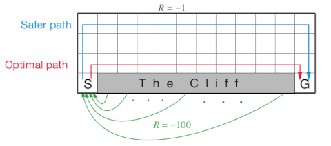

# Cliff Walking Gridworld MDP

The cliff walking gridworld MDP example from Chapter 6 of the textbook
"Reinforcement Learning: An Introduction."

## Format

An object of class
[MDP](http://michael.hahsler.net/markovDP/reference/MDP.md).

## Details

The cliff walking gridworld has the following layout:



The gridworld is represented as a 4 x 12 matrix of states. The states
are labeled with their x and y coordinates. The start state is in the
bottom left corner. Each action has a reward of -1, falling off the
cliff has a reward of -100 and returns the agent back to the start. The
episode is finished once the agent reaches the absorbing goal state in
the bottom right corner. No discounting is used (i.e., \\\gamma = 1\\).

## References

Richard S. Sutton and Andrew G. Barto (2018). Reinforcement Learning: An
Introduction Second Edition, MIT Press, Cambridge, MA.

## See also

Other MDP_examples:
[`DynaMaze`](http://michael.hahsler.net/markovDP/reference/DynaMaze.md),
[`MDP()`](http://michael.hahsler.net/markovDP/reference/MDP.md),
[`Maze`](http://michael.hahsler.net/markovDP/reference/Maze.md),
[`Windy_gridworld`](http://michael.hahsler.net/markovDP/reference/Windy_gridworld.md)

Other gridworld:
[`DynaMaze`](http://michael.hahsler.net/markovDP/reference/DynaMaze.md),
[`Maze`](http://michael.hahsler.net/markovDP/reference/Maze.md),
[`Windy_gridworld`](http://michael.hahsler.net/markovDP/reference/Windy_gridworld.md),
[`gridworld`](http://michael.hahsler.net/markovDP/reference/gridworld.md)

## Examples

``` r
data(Cliff_walking)
Cliff_walking
#> MDPModel, MDP - Cliff Walking Gridworld
#>   Discount factor: 1
#>   Horizon: Inf epochs
#>   Size: 4 actions / 38 states
#>   Storage: transition prob as matrix / reward as matrix. Total size: 139 Kb
#>   Start: s(4,1)
#>   Model list components: ‘name’, ‘discount’, ‘horizon’, ‘states’,
#>     ‘actions’, ‘start’, ‘transition_model’, ‘reward’, ‘info’,
#>     ‘absorbing_states’

gw_matrix(Cliff_walking)
#>      [,1]     [,2]     [,3]     [,4]     [,5]     [,6]     [,7]     [,8]    
#> [1,] "s(1,1)" "s(1,2)" "s(1,3)" "s(1,4)" "s(1,5)" "s(1,6)" "s(1,7)" "s(1,8)"
#> [2,] "s(2,1)" "s(2,2)" "s(2,3)" "s(2,4)" "s(2,5)" "s(2,6)" "s(2,7)" "s(2,8)"
#> [3,] "s(3,1)" "s(3,2)" "s(3,3)" "s(3,4)" "s(3,5)" "s(3,6)" "s(3,7)" "s(3,8)"
#> [4,] "s(4,1)" NA       NA       NA       NA       NA       NA       NA      
#>      [,9]     [,10]     [,11]     [,12]    
#> [1,] "s(1,9)" "s(1,10)" "s(1,11)" "s(1,12)"
#> [2,] "s(2,9)" "s(2,10)" "s(2,11)" "s(2,12)"
#> [3,] "s(3,9)" "s(3,10)" "s(3,11)" "s(3,12)"
#> [4,] NA       NA        NA        "s(4,12)"
gw_matrix(Cliff_walking, what = "labels")
#>      [,1]    [,2] [,3] [,4] [,5] [,6] [,7] [,8] [,9] [,10] [,11] [,12] 
#> [1,] ""      ""   ""   ""   ""   ""   ""   ""   ""   ""    ""    ""    
#> [2,] ""      ""   ""   ""   ""   ""   ""   ""   ""   ""    ""    ""    
#> [3,] ""      ""   ""   ""   ""   ""   ""   ""   ""   ""    ""    ""    
#> [4,] "Start" "X"  "X"  "X"  "X"  "X"  "X"  "X"  "X"  "X"   "X"   "Goal"

# The Goal is an absorbing state
absorbing_states(Cliff_walking, sparse = "states")
#> [1] "s(4,12)"

# visualize the transition graph
gw_plot_transition_graph(Cliff_walking)


# solve using different methods
sol <- solve_MDP(Cliff_walking)
sol
#> MDPModel, MDP - Cliff Walking Gridworld
#>   Discount factor: 1
#>   Horizon: Inf epochs
#>   Size: 4 actions / 38 states
#>   Storage: transition prob as matrix / reward as matrix. Total size: 144.4 Kb
#>   Start: s(4,1)
#>   Model list components: ‘name’, ‘discount’, ‘horizon’, ‘states’,
#>     ‘actions’, ‘start’, ‘transition_model’, ‘reward’, ‘info’,
#>     ‘absorbing_states’, ‘solution’
#> 
#>   Solved:
#>     Method: ‘VI’
#>     Solution converged: TRUE
#>   Solution list components: ‘method’, ‘policy’, ‘converged’, ‘delta’,
#>     ‘iterations’
policy(sol)
#>      state   V action
#> 1   s(1,1) -14   down
#> 2   s(2,1) -13   down
#> 3   s(3,1) -12  right
#> 4   s(4,1) -13     up
#> 5   s(1,2) -13  right
#> 6   s(2,2) -12   down
#> 7   s(3,2) -11  right
#> 8   s(1,3) -12  right
#> 9   s(2,3) -11   down
#> 10  s(3,3) -10  right
#> 11  s(1,4) -11  right
#> 12  s(2,4) -10   down
#> 13  s(3,4)  -9  right
#> 14  s(1,5) -10  right
#> 15  s(2,5)  -9   down
#> 16  s(3,5)  -8  right
#> 17  s(1,6)  -9  right
#> 18  s(2,6)  -8   down
#> 19  s(3,6)  -7  right
#> 20  s(1,7)  -8   down
#> 21  s(2,7)  -7  right
#> 22  s(3,7)  -6  right
#> 23  s(1,8)  -7   down
#> 24  s(2,8)  -6   down
#> 25  s(3,8)  -5  right
#> 26  s(1,9)  -6  right
#> 27  s(2,9)  -5  right
#> 28  s(3,9)  -4  right
#> 29 s(1,10)  -5   down
#> 30 s(2,10)  -4   down
#> 31 s(3,10)  -3  right
#> 32 s(1,11)  -4   down
#> 33 s(2,11)  -3   down
#> 34 s(3,11)  -2  right
#> 35 s(1,12)  -3   down
#> 36 s(2,12)  -2   down
#> 37 s(3,12)  -1   down
#> 38 s(4,12)   0   left
gw_plot(sol)
```
